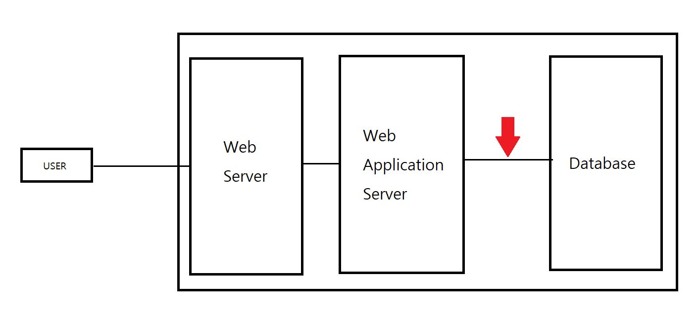
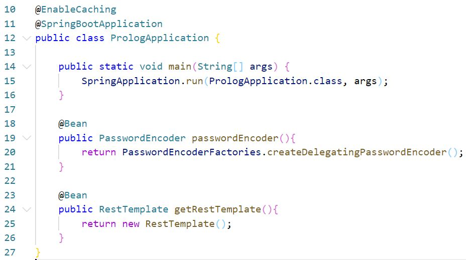

### 캐시에 관한 개인 학습 내용 정리

~~~
캐시(Cache)는 쉽게 임시 저장소라고 말할 수 있다.
~~~

### 공통 프로젝트 시스템 아키텍처 구성도

### 캐시가 적용된 공통 프로젝트 소스

pom.xml에 dependency 추가
~~~
<dependency> 
    <groupId>org.springframework.boot</groupId> 
    <artifactId>spring-boot-starter-data-redis</artifactId> 
</dependency>
~~~

application.yml에 redis 서버 설정
~~~
spring.cache.type=redis 
spring.redis.host=localhost 
spring.redis.port=6379
~~~

@EnableCaching 어노테이션 추가

