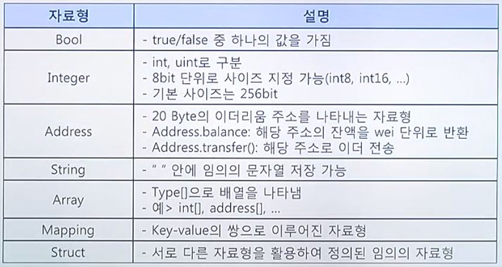

### 블록체인(2)

#### 이더리움이란?

###### 2013년, Vitalik Buterin이 제안한 공개형 블록체인
###### 분산 어플리케이션을 위한 플랫폼을 표방
###### Blockchain 2.0 - 비트코인의 scripting language를 개선, 발전시킨 스마트 컨트랙트
###### 이더 - 이더리움에서 발행한 암호화폐

##### 분산화된 상태전이 머신
- 트랜잭션에 기반한 상태전이
- 암호화 알고리즘을 활용->무작위로 상태전이가 일어나는 것을 방지
- 모든 참여자가 동일한 상태를 공유
- 블록은 해당 시점의 이더리움 상태를 나타낸다고 볼 수 있음

###### Genesis Block -> Block1 -> ... -> BlockN-1

##### 이더리움 계정의 종류
- 외부 소유 계정(EOA) - 개인 키를 통한 주소 관리
- 컨트랙트 계정(CA) - 컨트랙트 코드를 보유

##### 상태(State)
- 어느 한 시점에 대한 Ether의 잔액, 기타 정보를 담고 있는 계정들의 집합
- 모든 이더리움의 참여 노드는 로컬에 상태 정보를 유지함

##### 트랜잭션 종류
- (외부) 트랜잭션
- 내부 트랜잭션

EOA --외부--> CA --내부--> EOA
	         | 
                    내부
	         |
                     CA --내부--> EOA

EOA --외부--> EOA

##### 블록
- 이더리움 장부에 기록되는 데이터의 기본 단위
- 트랜잭션들의 집합

##### 엉클 블록
- 동일한 시점에 채굴된 블록 중 채굴 난이도가 낮아 메인 체인에 연결되지 못한 블록
- 블록생성 시간이 빠를 수록 엉클 블록의 발생확률이 높음

##### 스마트 컨트랙트 개발언어
- Solidity : 현재 가장 많이 사용되고 있는 이더리움 스마트 컨트랙트 언어
- SERPENT : 초창기 이더리움의 스마트 컨트랙트 언어
- LLL : (EVM을 위한) 어셈블리 언어와 유사

##### 가스(Gas)
- 이더리움을 움직이게 하는 '기본 단위'
- 트랜잭션, 스마트 컨트랙트를 위한 수수료
- 가스가격의 기본단위: Gwei

##### 이더리움의 동작 매커니즘
계정, 트랜잭션의 생성 -> 서명 -> 검증 -> 채굴

##### 이더리움 가상 머신
- 이더리움 스마트 컨트랙트를 실행하가ㅣ 위한 가상머신
- 특징 : 튜링 완전 머신, 스택 기반 구조, 32Byte의 메모리
	이더리움 주소 연산(160bit), 256bit 암호화 알고리즘 등 이더리움 관련 구조 연산에 최적화
- 모든 동작을 수행하기 위해서는 사전에 가스가 지불되어야 함
	: 이는 DoS 공격을 방지하기 위함
- EVM의 프로그램은 내부에서만 실행되고 가상머신의 HOST환경에는 접근 불가
- EVM간 메시지를 통해 데이터를 송수신 할 수 있음
- 결정적(Deterministic) 머신 -> 때문에 항상 동일한 상태를 반환

#### 솔리디티란?

##### 이더리움 스마트 컨트랙트 언어의 종류
- 가장 많이 활용되는 언어
- Java와 유사한 문법을 가짐

##### 특징
- 객체지향 언어
- 정적타입 언어
- 스택기반으로 동작하는 EVM 상에서 구동

##### 솔리디티 함수의 종류

##### 솔리디티 자료형의 종류
