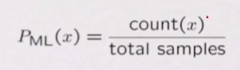

### 인공지능(3)

###### Naive Bayes Classifier모형은 모형 자체가 말이 되는 모형. 머신러닝에서 기본 모형. 베이스라인 모형.
###### Digit Recognizer를 이용
###### -> pixel grids를 input, a digit 0-9를 output
###### Parameter Estimation
###### Empirically: use training data
###### Elicitation: ask a human!

###### Naive Bayes Classifier모형에 대해 알 수 있었다.