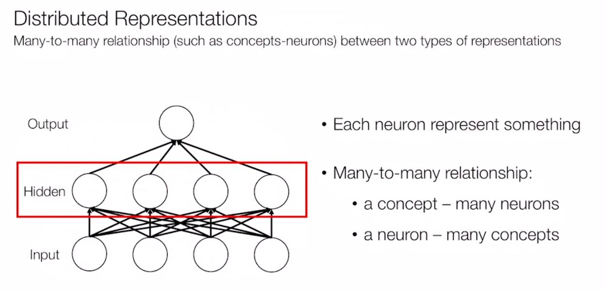

### 인공지능(4)

###### Deep Natural Language Processing

###### 모든 단어에서 의미를 추출해내는것이 NLP의 주요 목적
"Word Embedding"

###### Assign meaningful numbers to a word, in order to use them as inputs for NLP systems

###### Representations
Hypothetical internal cognitive symbol that represents external

